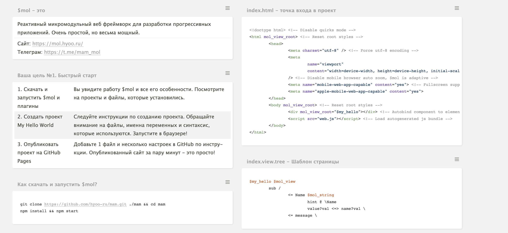

# 🏠 Главная

Познакомьтесь с инфруструктурой $mol на Miro [https://miro.com/app/board/uXjVPiu7rlM=/?share\_link\_id=958537708397](https://miro.com/app/board/uXjVPiu7rlM=/?share\_link\_id=958537708397)



Если вы только познакомились с $mol, то ваша 1 задача для начала - попробовать на практике Hello World проект и запушить на GitHub Pages.

1. Скачать и запустить $mol и плагины
2. Создать проект My Hello World
3. Опубли­ковать проект на GitHub Pages

Вам поможет на первое время [Шпаргалка по Hello World!](https://cheatography.com/milis/cheat-sheets/mol/) и [bystryi-start](praktika/bystryi-start/ "mention")

### Скачать Шпаргалку можно тут: [https://t.me/mam\_mol/114523](https://t.me/mam\_mol/114523)

<figure><figcaption>
<a href="https://cheatography.com/milis/cheat-sheets/mol/">https://cheatography.com/milis/cheat-sheets/mol/</a>
</figcaption></figure>

Почему $mol? [https://mol.hyoo.ru/#!Description=Features](https://mol.hyoo.ru/#!Description=Features)

Попробовать $mol онлайн: [https://gitpod.io/#https://github.com/hyoo-ru/mam](https://gitpod.io/#https://github.com/hyoo-ru/mam)

Если у вас есть предложения по улучшению документации, пишите в нашем чате в телеграмме [https://t.me/mol\_news](https://t.me/mol\_news) , мы их обязательно учтём и добавим. А может и вы сами захотите. [priglashaem-vsekh-k-uluchsheniyu-dokumentacii.md](glavnaya/priglashaem-vsekh-k-uluchsheniyu-dokumentacii.md "mention")
