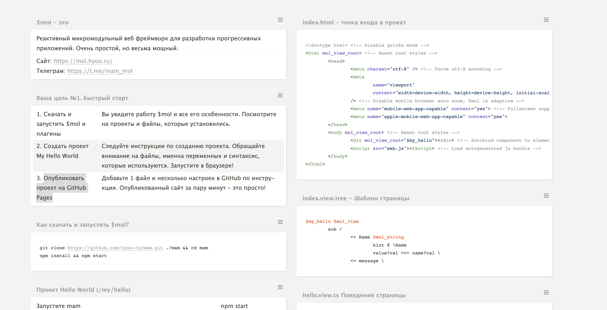

# Как интегрировать что-то в $mol?

<details>

<summary>Как интегрировать Web Components?</summary>

Интегрировать Веб Компоненты в $mol можно. \
На данный момент процесс интеграции вебкомпонентов состоит из нескольких этапов. \
Рассмотрим на примере Веб Компонента WYSIWYG редактора [https://github.com/webislife/wc-wysiwyg](https://github.com/webislife/wc-wysiwyg) от @webislive. [Демо](https://webislife.ru/demo/wc-wysiwyg/)

.png>)\
Сайт на мол: [https://reatailret.github.io/mam\_examples/wcwysiwygeditor/examplepage/vite/build/](https://reatailret.github.io/mam\_examples/wcwysiwygeditor/examplepage/vite/build/)\
Репозиторий: [https://github.com/reatailret/mam\_examples/tree/master/wcwysiwygeditor](https://github.com/reatailret/mam\_examples/tree/master/wcwysiwygeditor)\
\
1\. Собрать билд Веб Компонента. Используются сборщик Vite на данный момент. [https://github.com/reatailret/mam\_examples/tree/master/wcwysiwygeditor/examplepage/vite](https://github.com/reatailret/mam\_examples/tree/master/wcwysiwygeditor/examplepage/vite) . В будущем, когда появится большая необходимость в Веб Компонентах, этот процесс будет интегрирован в сам $mol\
2\. Интегрировать сам Веб Компонент в компонент $mol [https://github.com/reatailret/mam\_examples/blob/master/wcwysiwygeditor/component/component.view.tree.ts#L3-L9](https://github.com/reatailret/mam\_examples/blob/master/wcwysiwygeditor/component/component.view.tree.ts#L3-L9)

```
auto(){
	import('wc-wysiwyg-editor').then(esm => {
		esm.define();
	});
	import('wc-wysiwyg-editor/dist/sass/wc-wysiwyg.css');
	import('wc-wysiwyg-editor/dist/sass/content.css');
}
```


После этого вы сможете использовать ВК как любой другой компонент в моле.


Чтобы запустить локально проект, нужно немного освоить $mol из секции [bystryi-start](../praktika/bystryi-start/ "mention")

1. Скачать MAM на компьютер. Это общее рабочее пространство для всех проектов на $mol. [https://mol.hyoo.ru/#!Description=Create%20MAM%20project](https://mol.hyoo.ru/#!Description=Create%20MAM%20project)
2. Создать папку /examples в скаченом MAM проект.&#x20;
3. Склонировать [https://github.com/reatailret/mam\_examples](https://github.com/reatailret/mam\_examples/tree/master/wcwysiwygeditor) на компьютер и перенести папку  /wcwysiwygeditor в /examples
4. Запустить mam `npm start` и перейти в папку с проектом `localhost:9080/examples/wcwysiwygeditor` - у вас октроется текущий репозиторий.

</details>
